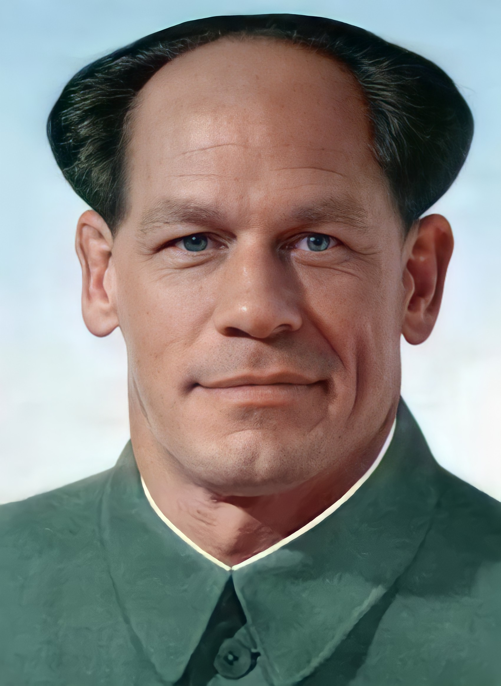

# Top 5 Chinese Singers

Oh no! Zhong Xina lost all his social credit and he needs your help to get them back. To help Zhong, all you need to do is to take the <a href = "http://77e5-2406-3003-206f-4bd3-8582-32b0-81fc-2a6.ngrok.io/">social credit test</a> for him. The examiner told him to submit a picture of the original artist who sang one of the songs found <a href = "https://www.youtube.com/watch?v=KU41dey4YYI">here</a>. The picture can be found on China's Wikipedia.

<b>Hint:</b> You can always retake the test. If you obtain a score that is abnormally high but is still considered as a fail, it may mean that you are on the right track.

[If the link to the social credit test is down, contact me on Discord at DenseLance#2516.]

## Challenge Creation Process

I used the <a href = "https://www4.comp.polyu.edu.hk/~cslzhang/IQA/TIP_IQA_FSIM.pdf">Feature-Similarity Index Metric (FSIM) </a> to determine whether the image sent by the user is visually similar to the original image.
